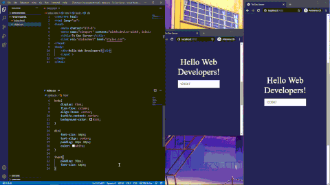
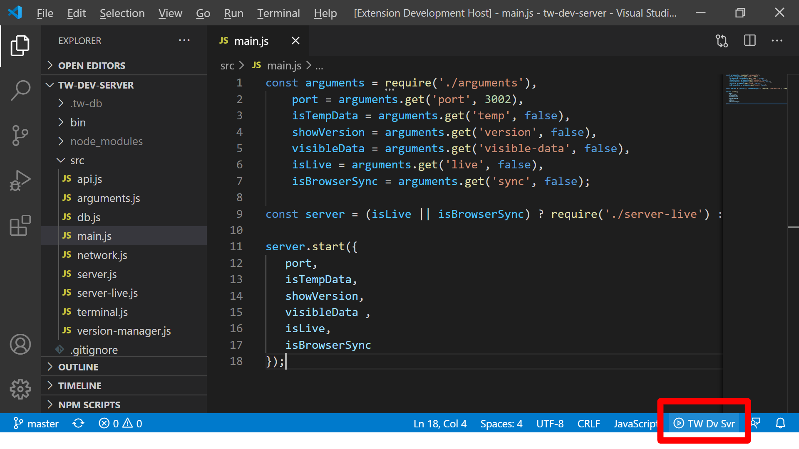
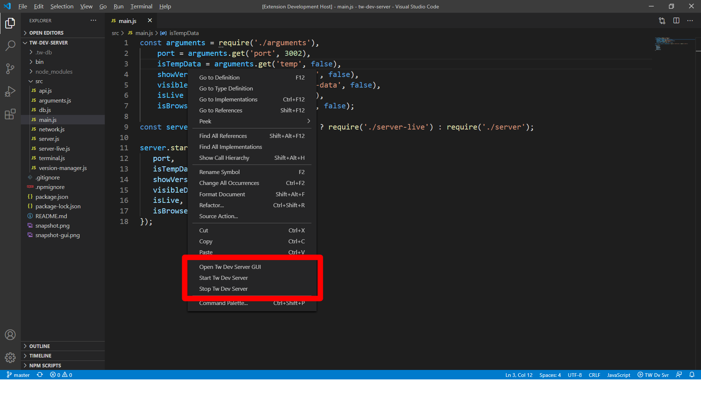
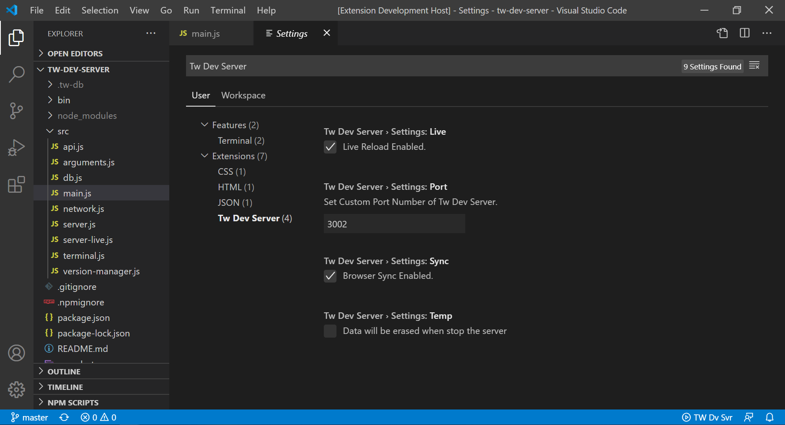

# TW Dev Server for VS Code
[https://treinaweb.com.br](https://treinaweb.com.br)

A powerful and lightweight server to be used for testing, local development and learning.

Use it as static file server and CRUD server. It has live reload and browser sync too!

## Installation

Open VSCode and type `Ctrl+P`, type `ext install treinaweb.tw-dev-server`.

## Usage

Click on status bar item to Start/Stop the server. Go to [http://localhost:3002](http://localhost:3002) to view your server

### GUI

You can make requests on [https://treinaweb.github.io/tw-dev-server](https://treinaweb.github.io/tw-dev-server)

You can open this page on the `Right Click` menu. The options to Start/Stop the server are there too.

### Extension Settings

You can customize some options. Press `Ctrl + ,` to go to Settings.

| Name        | Description           |
| ------------- |-------------|
| Port     | port to use (defaults to 3002) | 
| Temp     | data will be erased when stop the server (defaults to false) | 
| Sync     | live reload and browser sync (defaults to true) |
| Live     | live reload (no browser sync) (defaults to true) |

### CRUD Operations

CRUD operations are available under "/api/".

| Method        | URL           | Description  |
| ------------- |-------------| -----|
|  GET    | http://localhost:3002/api/:project-name/:object-name | returns all :object-name from storage |
|  GET    | http://localhost:3002/api/:project-name/:object-name?id=:id | returns the :object-name with the :id ID |
|  POST    | http://localhost:3002/api/:project-name/:object-name | saves some data on :object-name |
|  PUT     | http://localhost:3002/api/:project-name/:object-name?id=:id | updates the :object-name with the :id ID |
|  DELETE    | http://localhost:3002/api/:project-name/:object-name?id=:id | erases the :object-name with the :id ID |
|  DELETE    | http://localhost:3002/api/:project-name/:object-name?id=all | erases all :object-name from :project-name |

*URL Examples:*

- http://localhost:3002/api/my-school/book?id=123
- http://localhost:3002/api/my-school/users/
- http://localhost:3002/api/market/products/
- http://localhost:3002/api/v1/market/products/
- http://localhost:3002/api/some-prefix/another-prefix/market/products?id=12345
